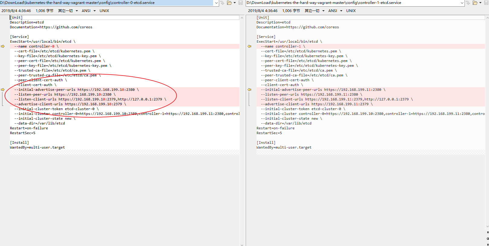
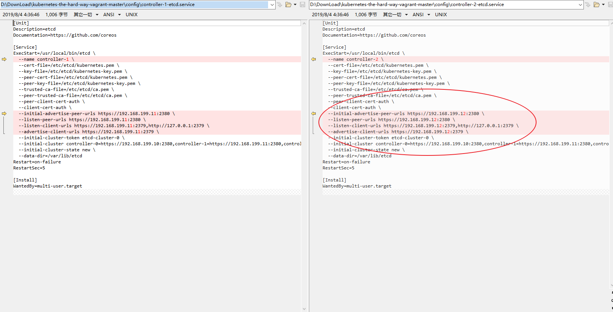
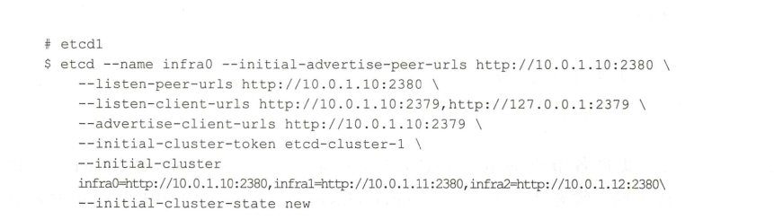

# etcd集群的搭建和验证


| 名称 | 位置 |
| --- | --- |
| etcd | /usr/local/bin/etcd |
| etcdctl | /usr/local/bin/etcdctl |
| etcd.service | /lib/systemd/system/etcd.service |
| etcd.conf | /etc/etcd/etcd.conf |
| *.pem | /etc/etcd/*.pem |
|  /var/lib/etcd  |  data-storage-dir  |


##  intro

https://github.com/latermonk/etcd 


## 下载二进制镜像

```

wget 
https://github.com/etcd-io/etcd/releases/download/v3.3.9/etcd-v3.3.9-linux-amd64.tar.gz

tar -xf  etcd-v3.3.9-linux-amd64.tar.gz


```

## etcd etcdctl


```
chmod +x  etc*

mv  etc*   /usr/local/bin


```

##  *.pems


##   etcd.service


```
[Unit]
Description=etcd
Documentation=https://github.com/coreos

[Service]
ExecStart=/usr/local/bin/etcd \
  --name controller-0 \
  --cert-file=/etc/etcd/kubernetes.pem \
  --key-file=/etc/etcd/kubernetes-key.pem \
  --peer-cert-file=/etc/etcd/kubernetes.pem \
  --peer-key-file=/etc/etcd/kubernetes-key.pem \
  --trusted-ca-file=/etc/etcd/ca.pem \
  --peer-trusted-ca-file=/etc/etcd/ca.pem \
  --peer-client-cert-auth \
  --client-cert-auth \
  --initial-advertise-peer-urls https://192.168.199.10:2380 \
  --listen-peer-urls https://192.168.199.10:2380 \
  --listen-client-urls https://192.168.199.10:2379,http://127.0.0.1:2379 \
  --advertise-client-urls https://192.168.199.10:2379 \
  --initial-cluster-token etcd-cluster-0 \
  --initial-cluster controller-0=https://192.168.199.10:2380,controller-1=https://192.168.199.11:2380,controller-2=https://192.168.199.12:2380 \
  --initial-cluster-state new \
  --data-dir=/var/lib/etcd
Restart=on-failure
RestartSec=5

[Install]
WantedBy=multi-user.target

```

-----

#  **manual:**

## etcd


```
usage: etcd [flags]
       start an etcd server

       etcd --version
       show the version of etcd

       etcd -h | --help
       show the help information about etcd

       etcd --config-file
       path to the server configuration file

       etcd gateway
       run the stateless pass-through etcd TCP connection forwarding proxy

       etcd grpc-proxy
       run the stateless etcd v3 gRPC L7 reverse proxy


member flags:

	--name 'default'
		human-readable name for this member.
	--data-dir '${name}.etcd'
		path to the data directory.
	--wal-dir ''
		path to the dedicated wal directory.
	--snapshot-count '100000'
		number of committed transactions to trigger a snapshot to disk.
	--heartbeat-interval '100'
		time (in milliseconds) of a heartbeat interval.
	--election-timeout '1000'
		time (in milliseconds) for an election to timeout. See tuning documentation for details.
	--initial-election-tick-advance 'true'
		whether to fast-forward initial election ticks on boot for faster election.
	--listen-peer-urls 'http://localhost:2380'
		list of URLs to listen on for peer traffic.
	--listen-client-urls 'http://localhost:2379'
		list of URLs to listen on for client traffic.
	--max-snapshots '5'
		maximum number of snapshot files to retain (0 is unlimited).
	--max-wals '5'
		maximum number of wal files to retain (0 is unlimited).
	--cors ''
		comma-separated whitelist of origins for CORS (cross-origin resource sharing).
	--quota-backend-bytes '0'
		raise alarms when backend size exceeds the given quota (0 defaults to low space quota).
	--max-txn-ops '128'
		maximum number of operations permitted in a transaction.
	--max-request-bytes '1572864'
		maximum client request size in bytes the server will accept.
	--grpc-keepalive-min-time '5s'
		minimum duration interval that a client should wait before pinging server.
	--grpc-keepalive-interval '2h'
		frequency duration of server-to-client ping to check if a connection is alive (0 to disable).
	--grpc-keepalive-timeout '20s'
		additional duration of wait before closing a non-responsive connection (0 to disable).

clustering flags:

	--initial-advertise-peer-urls 'http://localhost:2380'
		list of this member's peer URLs to advertise to the rest of the cluster.
	--initial-cluster 'default=http://localhost:2380'
		initial cluster configuration for bootstrapping.
	--initial-cluster-state 'new'
		initial cluster state ('new' or 'existing').
	--initial-cluster-token 'etcd-cluster'
		initial cluster token for the etcd cluster during bootstrap.
		Specifying this can protect you from unintended cross-cluster interaction when running multiple clusters.
	--advertise-client-urls 'http://localhost:2379'
		list of this member's client URLs to advertise to the public.
		The client URLs advertised should be accessible to machines that talk to etcd cluster. etcd client libraries parse these URLs to connect to the cluster.
	--discovery ''
		discovery URL used to bootstrap the cluster.
	--discovery-fallback 'proxy'
		expected behavior ('exit' or 'proxy') when discovery services fails.
		"proxy" supports v2 API only.
	--discovery-proxy ''
		HTTP proxy to use for traffic to discovery service.
	--discovery-srv ''
		dns srv domain used to bootstrap the cluster.
	--strict-reconfig-check 'true'
		reject reconfiguration requests that would cause quorum loss.
	--auto-compaction-retention '0'
		auto compaction retention length. 0 means disable auto compaction.
	--auto-compaction-mode 'periodic'
		interpret 'auto-compaction-retention' one of: periodic|revision. 'periodic' for duration based retention, defaulting to hours if no time unit is provided (e.g. '5m'). 'revision' for revision number based retention.
	--enable-v2 'true'
		Accept etcd V2 client requests.

proxy flags:
	"proxy" supports v2 API only.

	--proxy 'off'
		proxy mode setting ('off', 'readonly' or 'on').
	--proxy-failure-wait 5000
		time (in milliseconds) an endpoint will be held in a failed state.
	--proxy-refresh-interval 30000
		time (in milliseconds) of the endpoints refresh interval.
	--proxy-dial-timeout 1000
		time (in milliseconds) for a dial to timeout.
	--proxy-write-timeout 5000
		time (in milliseconds) for a write to timeout.
	--proxy-read-timeout 0
		time (in milliseconds) for a read to timeout.


security flags:

	--ca-file '' [DEPRECATED]
		path to the client server TLS CA file. '-ca-file ca.crt' could be replaced by '-trusted-ca-file ca.crt -client-cert-auth' and etcd will perform the same.
	--cert-file ''
		path to the client server TLS cert file.
	--key-file ''
		path to the client server TLS key file.
	--client-cert-auth 'false'
		enable client cert authentication.
	--client-crl-file ''
		path to the client certificate revocation list file.
	--trusted-ca-file ''
		path to the client server TLS trusted CA cert file.
	--auto-tls 'false'
		client TLS using generated certificates.
	--peer-ca-file '' [DEPRECATED]
		path to the peer server TLS CA file. '-peer-ca-file ca.crt' could be replaced by '-peer-trusted-ca-file ca.crt -peer-client-cert-auth' and etcd will perform the same.
	--peer-cert-file ''
		path to the peer server TLS cert file.
	--peer-key-file ''
		path to the peer server TLS key file.
	--peer-client-cert-auth 'false'
		enable peer client cert authentication.
	--peer-trusted-ca-file ''
		path to the peer server TLS trusted CA file.
	--peer-cert-allowed-cn ''
		Required CN for client certs connecting to the peer endpoint.
	--peer-auto-tls 'false'
		peer TLS using self-generated certificates if --peer-key-file and --peer-cert-file are not provided.
	--peer-crl-file ''
		path to the peer certificate revocation list file.
	--cipher-suites ''
		comma-separated list of supported TLS cipher suites between client/server and peers (empty will be auto-populated by Go).

logging flags

	--debug 'false'
		enable debug-level logging for etcd.
	--log-package-levels ''
		specify a particular log level for each etcd package (eg: 'etcdmain=CRITICAL,etcdserver=DEBUG').
	--log-output 'default'
		specify 'stdout' or 'stderr' to skip journald logging even when running under systemd.

unsafe flags:

Please be CAUTIOUS when using unsafe flags because it will break the guarantees
given by the consensus protocol.

	--force-new-cluster 'false'
		force to create a new one-member cluster.

profiling flags:
	--enable-pprof 'false'
		Enable runtime profiling data via HTTP server. Address is at client URL + "/debug/pprof/"
	--metrics 'basic'
		Set level of detail for exported metrics, specify 'extensive' to include histogram metrics.
	--listen-metrics-urls ''
		List of URLs to listen on for metrics.

auth flags:
	--auth-token 'simple'
		Specify a v3 authentication token type and its options ('simple' or 'jwt').

experimental flags:
	--experimental-initial-corrupt-check 'false'
		enable to check data corruption before serving any client/peer traffic.
	--experimental-corrupt-check-time '0s'
		duration of time between cluster corruption check passes.
	--experimental-enable-v2v3 ''
		serve v2 requests through the v3 backend under a given prefix.


```

**etcd在2379监听客户端的请求，在2380监听peer端的请求**

**检查节点健康信息**


```
V2:  etcdctl member list
V3:  ETCDCTL_API=3 etcdctl member list


```





##  etcd 参数解析





```
--name  infra0   节点名称
```

```
--initial-advertise-peer-urls
```

```
--listen-peer-urls 'http://localhost:2380'

```

```

--listen-client-urls  监听客户端的端口

--listen-client-urls https://192.168.199.10:2379,http://127.0.0.1:2379 

```

```

--advertise-client-urls  单个节点的对外接收客户端指令的IP和端口

--advertise-client-urls https://192.168.199.10:2379
```

```
--initial-cluster-token
```


```
--initial-cluster  所有节点的对外接收客户端指令的IP和端口-列表

--initial-cluster controller-0=https://192.168.199.10:2380,controller-1=https://192.168.199.11:2380,controller-2=https://192.168.199.12:2380

```

```
--initial-cluster-state
```


##  etcdctl


```
NAME:
   etcdctl - A simple command line client for etcd.

WARNING:
   Environment variable ETCDCTL_API is not set; defaults to etcdctl v2.
   Set environment variable ETCDCTL_API=3 to use v3 API or ETCDCTL_API=2 to use v2 API.

USAGE:
   etcdctl [global options] command [command options] [arguments...]
   
VERSION:
   3.3.9
   
COMMANDS:
     backup          backup an etcd directory
     cluster-health  check the health of the etcd cluster
     mk              make a new key with a given value
     mkdir           make a new directory
     rm              remove a key or a directory
     rmdir           removes the key if it is an empty directory or a key-value pair
     get             retrieve the value of a key
     ls              retrieve a directory
     set             set the value of a key
     setdir          create a new directory or update an existing directory TTL
     update          update an existing key with a given value
     updatedir       update an existing directory
     watch           watch a key for changes
     exec-watch      watch a key for changes and exec an executable
     member          member add, remove and list subcommands
     user            user add, grant and revoke subcommands
     role            role add, grant and revoke subcommands
     auth            overall auth controls
     help, h         Shows a list of commands or help for one command

GLOBAL OPTIONS:
   --debug                          output cURL commands which can be used to reproduce the request
   --no-sync                        don't synchronize cluster information before sending request
   --output simple, -o simple       output response in the given format (simple, `extended` or `json`) (default: "simple")
   --discovery-srv value, -D value  domain name to query for SRV records describing cluster endpoints
   --insecure-discovery             accept insecure SRV records describing cluster endpoints
   --peers value, -C value          DEPRECATED - "--endpoints" should be used instead
   --endpoint value                 DEPRECATED - "--endpoints" should be used instead
   --endpoints value                a comma-delimited list of machine addresses in the cluster (default: "http://127.0.0.1:2379,http://127.0.0.1:4001")
   --cert-file value                identify HTTPS client using this SSL certificate file
   --key-file value                 identify HTTPS client using this SSL key file
   --ca-file value                  verify certificates of HTTPS-enabled servers using this CA bundle
   --username value, -u value       provide username[:password] and prompt if password is not supplied.
   --timeout value                  connection timeout per request (default: 2s)
   --total-timeout value            timeout for the command execution (except watch) (default: 5s)
   --help, -h                       show help
   --version, -v                    print the version
   

```


**status**

```
systemctl status etcd
```


查看版本


```
etcd --version
```
etcd监听两个端口 2379 & 2380


---
#  reference 

https://www.cnblogs.com/breg/p/5756558.html   

https://blog.csdn.net/fnatic_/article/details/84307332

ETCD集群的常见问题处理（微信）

https://www.cnblogs.com/netonline/p/8665847.html


#   单节点etcd搭建：

**节点 10.254.21.1上搭建etc服务器**

```
[Unit]
Description=etcd
Documentation=https://github.com/coreos

[Service]
ExecStart=/usr/local/bin/etcd \
  --name controller-0 \
  --data-dir=/var/lib/etcd \
  --listen-client-urls http://10.254.21.1:2379,http://127.0.0.1:2379 \
  --advertise-client-urls http://10.254.21.1:2379 \
  --listen-peer-urls http://10.254.21.1:2380 \
  --initial-advertise-peer-urls http://10.254.21.1:2380 \
  --initial-cluster  controller-0=https://10.254.21.1:2380 \
  --initial-cluster-token 'etcd-cluster' \
  --initial-cluster-state 'new'

Restart=on-failure
RestartSec=5

[Install]
WantedBy=multi-user.target

```


