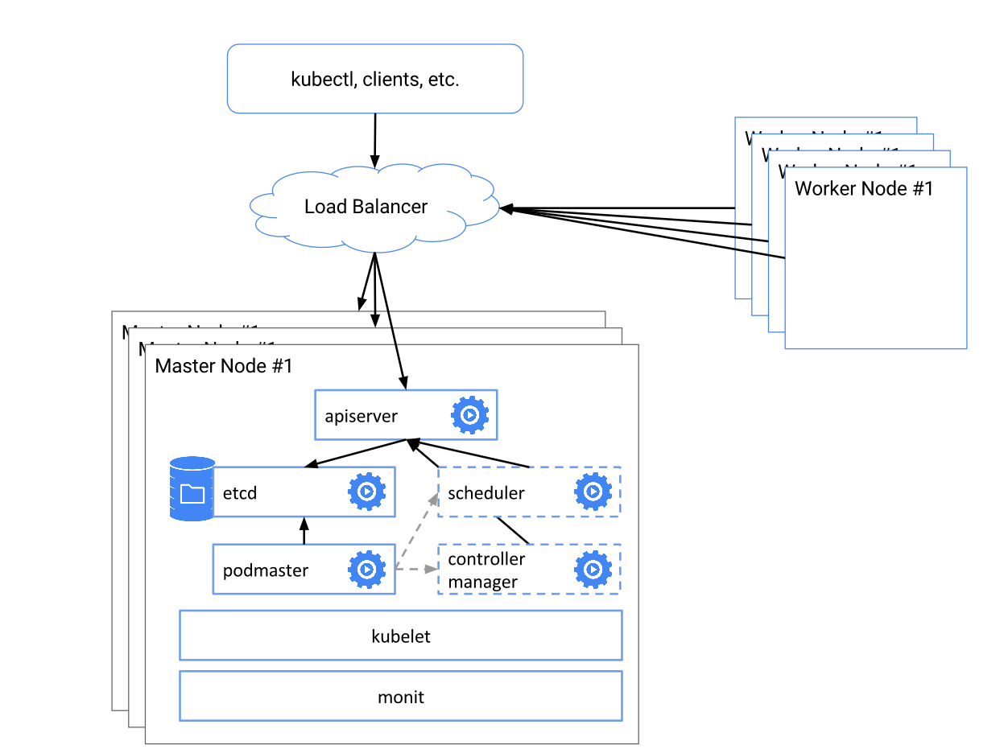

# 高可用





# Components:  
https://kubernetes.io/docs/concepts/overview/components/    


#  controller


**api-server**


```
[Unit]
Description=Kubernetes API Server
Documentation=https://github.com/GoogleCloudPlatform/kubernetes

[Service]
ExecStart=/usr/local/bin/kube-apiserver \
  --enable-admission-plugins=Initializers,NamespaceLifecycle,NodeRestriction,LimitRanger,ServiceAccount,DefaultStorageClass,ResourceQuota \
  --advertise-address=192.168.199.10 \
  --allow-privileged=true \
  --apiserver-count=3 \
  --audit-log-maxage=30 \
  --audit-log-maxbackup=3 \
  --audit-log-maxsize=100 \
  --audit-log-path=/var/log/audit.log \
  --authorization-mode=Node,RBAC \
  --bind-address=0.0.0.0 \
  --client-ca-file=/var/lib/kubernetes/ca.pem \
  --enable-swagger-ui=true \
  --etcd-cafile=/var/lib/kubernetes/ca.pem \
  --etcd-certfile=/var/lib/kubernetes/kubernetes.pem \
  --etcd-keyfile=/var/lib/kubernetes/kubernetes-key.pem \
  --etcd-servers=https://192.168.199.10:2379,https://192.168.199.11:2379,https://192.168.199.12:2379 \
  --event-ttl=1h \
  --experimental-encryption-provider-config=/var/lib/kubernetes/encryption-config.yaml \
  --kubelet-certificate-authority=/var/lib/kubernetes/ca.pem \
  --kubelet-client-certificate=/var/lib/kubernetes/kubernetes.pem \
  --kubelet-client-key=/var/lib/kubernetes/kubernetes-key.pem \
  --kubelet-https=true \
  --runtime-config=api/all \
  --service-account-key-file=/var/lib/kubernetes/ca-key.pem \
  --service-cluster-ip-range=10.32.0.0/24 \
  --service-node-port-range=30000-32767 \
  --tls-cert-file=/var/lib/kubernetes/kubernetes.pem \
  --tls-private-key-file=/var/lib/kubernetes/kubernetes-key.pem \
  --v=2
Restart=on-failure
RestartSec=5

[Install]
WantedBy=multi-user.target

```


**controller-manager**


```
[Unit]
Description=Kubernetes Controller Manager
Documentation=https://github.com/GoogleCloudPlatform/kubernetes

[Service]
ExecStart=/usr/local/bin/kube-controller-manager \
  --bind-address=0.0.0.0 \
  --cluster-cidr=10.200.0.0/16 \
  --cluster-name=kubernetes \
  --cluster-signing-cert-file=/var/lib/kubernetes/ca.pem \
  --cluster-signing-key-file=/var/lib/kubernetes/ca-key.pem \
  --leader-elect=true \
  --master=http://127.0.0.1:8080 \
  --root-ca-file=/var/lib/kubernetes/ca.pem \
  --service-account-private-key-file=/var/lib/kubernetes/ca-key.pem \
  --service-cluster-ip-range=10.32.0.0/24 \
  --v=2
Restart=on-failure
RestartSec=5

[Install]
WantedBy=multi-user.target

```


**scheduler**


```
[Unit]
Description=Kubernetes Scheduler
Documentation=https://github.com/GoogleCloudPlatform/kubernetes

[Service]
ExecStart=/usr/local/bin/kube-scheduler \
  --leader-elect=true \
  --master=http://127.0.0.1:8080 \
  --v=2
Restart=on-failure
RestartSec=5

[Install]
WantedBy=multi-user.target

```

